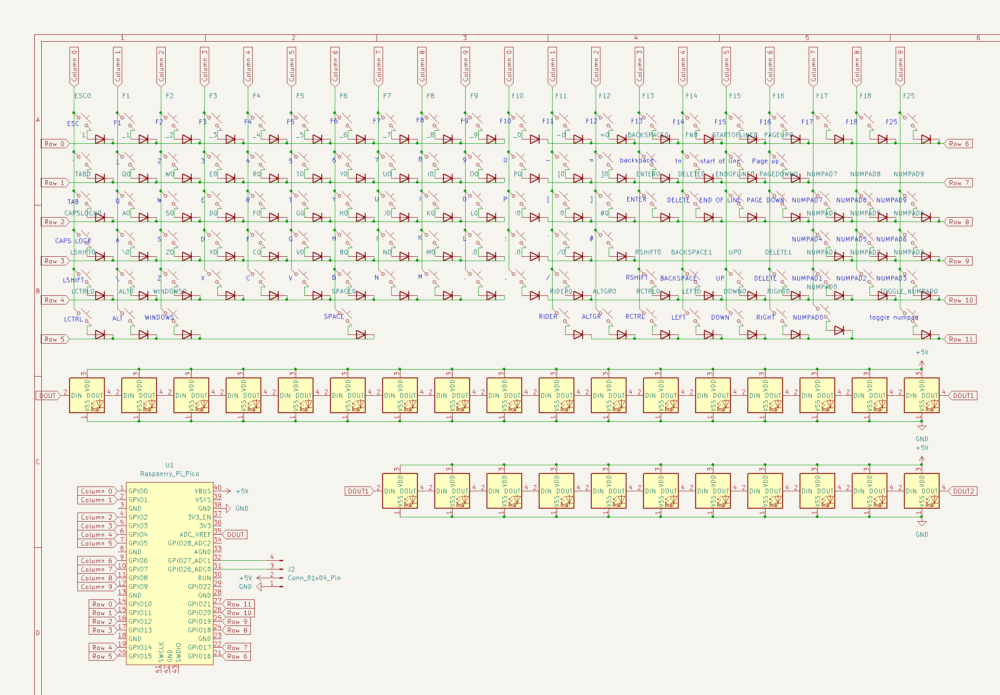
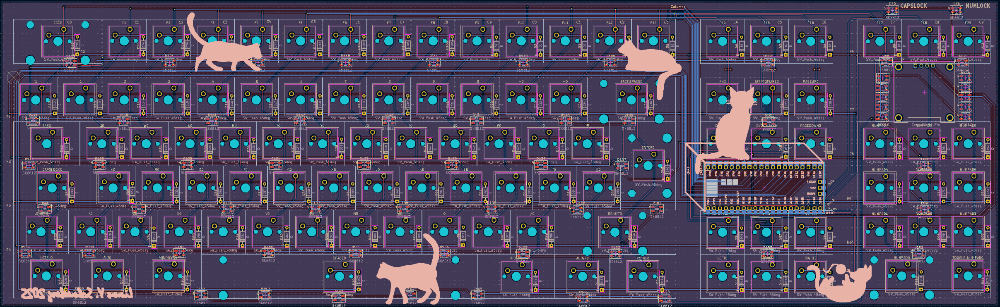
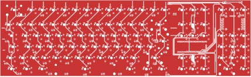
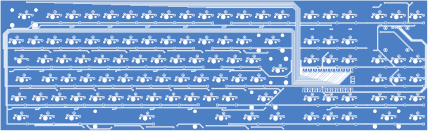

# Linus Keyboard

<!-- Insert render later -->

## Description
This is an almost full sized keyboard with a slightly modified ISO layout.
Here is a list of all the differences:

- The keys in the top row are ESC, F1 - F18, F25
- I removed the right column of the numpad since I never use it
- I also moved the numlock key to the bottom row and removed the 
top row of the numpad as well
- I replaced the second Windows key with another key which will probably activate a
  custom layer in my keymap
- I changed the size of my escape key (which was really dumb because I will never find an
  escape key with that size)
- I added two buttons to the sides of the up arrow key:
  - A backspace key on the left
  - A delete key on the right
  
## Features
There are 67 RGB LEDS in the keyboard which can be individually controlled.
I have also added a 128x64 OLED display. I'm planning to implement tetris on it!

## Schematic

## PCB

### F.Cu

### B.Cu

### B.Silkscreen
I added a few cats to the back silkscreen. I hope you like them!

## BOM